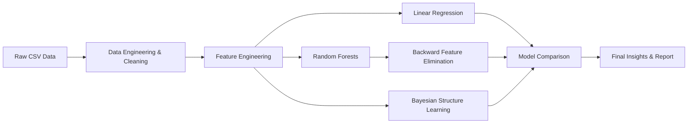

<div align="center">

# 🛒 Walmart Sales Prediction using Machine Learning

### Forecasting weekly retail sales with Linear Regression, Random Forests & Bayesian Structure Learning

[](https://www.python.org/)
[](https://scikit-learn.org/)
[](https://jupyter.org/)
[](#license)

[](https://github.com/ParthSharma-2/Walmart-Sales-Prediction-Using-ML/stargazers)
[](https://github.com/ParthSharma-2/Walmart-Sales-Prediction-Using-ML/forks)
[](https://github.com/ParthSharma-2/Walmart-Sales-Prediction-Using-ML/commits/main)

**A comparative study of predictive models on 421,570 real-world retail records — achieving 97.07% accuracy with ensemble learning.**

[View Demo Notebooks](#-notebooks) • [Report Bug](https://github.com/ParthSharma-2/Walmart-Sales-Prediction-Using-ML/issues) • [Request Feature](https://github.com/ParthSharma-2/Walmart-Sales-Prediction-Using-ML/issues)

</div>

<br>

## 📖 Table of Contents

- [Overview](#-overview)
- [Key Results](#-key-results)
- [Dataset](#-dataset)
- [Project Pipeline](#-project-pipeline)
- [Models](#-models)
  - [Linear Regression](#1-linear-regression)
  - [Random Forests](#2-random-forests)
  - [Backward Feature Elimination](#3-backward-feature-elimination)
  - [Bayesian Network Structure Learning](#4-bayesian-network-structure-learning)
- [Model Comparison](#-model-comparison)
- [Notebooks](#-notebooks)
- [Getting Started](#-getting-started)
- [Tech Stack](#-tech-stack)
- [Repository Structure](#-repository-structure)
- [Future Improvements](#-future-improvements)
- [Author](#-author)

<br>

## 🔍 Overview

This project tackles a real business problem faced by Walmart: **predicting weekly sales across 45 stores and 99+ departments**, accounting for seasonality, holidays, markdowns, and macroeconomic indicators like CPI and unemployment.

Three modeling approaches are built and compared end-to-end:

- 📈 **Linear Regression** — a simple, interpretable baseline
- 🌲 **Random Forests** — an ensemble model tuned for accuracy, with embedded feature selection
- 🕸️ **Bayesian Network Structure Learning** — used to uncover probabilistic relationships between variables

<br>

## 🏆 Key Results

<div align="center">

| Metric | Value |
|---|---|
| 🎯 **Best Model Accuracy** | **97.07%** (Random Forests) |
| 📊 **Records Analyzed** | 421,570 |
| 🏬 **Stores Covered** | 45 |
| 🧮 **Optimal Feature Set** | 6 features → 95.32% accuracy |
| ⭐ **Top 2 Features' Contribution** | 91.53% of predictive power |

</div>

<br>

## 📦 Dataset

Sourced from [Kaggle — Retail Data Set](https://www.kaggle.com/manjeetsingh/retaildataset), spanning **Feb 2010 – Nov 2012** across three linked files:

| File | Description |
|---|---|
| `Sales_data-set.csv` | Weekly sales by store and department |
| `Store_data-set.csv` | Store type and size |
| `Features_dataset.csv` | Temperature, fuel price, CPI, unemployment, markdowns, holiday flag |

<details>
<summary><b>📋 Click to view sample data schema</b></summary>

<br>

**Features table**

| Store | Date | Temperature | Fuel_Price | CPI | Unemployment | IsHoliday |
|---|---|---|---|---|---|---|
| 1 | 05/02/2010 | 42.31 | 2.572 | 211.10 | 8.106 | FALSE |
| 1 | 12/02/2010 | 38.51 | 2.548 | 211.24 | 8.106 | TRUE |

**Sales table**

| Store | Dept | Date | Weekly_Sales | IsHoliday |
|---|---|---|---|---|
| 1 | 1 | 05/02/2010 | 24924.50 | 0 |
| 1 | 1 | 12/02/2010 | 46039.49 | 1 |

**Stores table**

| Store | Type | Size |
|---|---|---|
| 1 | A | 151,315 |
| 2 | A | 202,307 |
| 3 | B | 37,392 |

</details>

<br>

## 🔄 Project Pipeline



<br>

## 🤖 Models

### 1. Linear Regression

A simple, easily interpretable model used as a baseline for comparison against more complex approaches.

<p align="center">

</p>

> **Result:** 11.56% accuracy — confirms sales data has strong non-linear and categorical dependencies that linear models can't capture.

<br>

### 2. Random Forests

An ensemble of decision trees trained on bootstrapped samples, with predictions averaged across trees (bagging). This reduces variance without increasing bias, giving high accuracy while staying robust to noise.

<p align="center">

</p>

Random Forests also provide **embedded feature selection** and reliable test-error estimates without the cost of repeated cross-validation.

<p align="center">

</p>

> **Result:** 97.07% accuracy — the best-performing model in this project.

<br>

### 3. Backward Feature Elimination

Using feature importances from the Random Forest model, features are removed one at a time to find the optimal, lightest-weight feature set.

<p align="center">

</p>

- ✅ Optimal subset: **Dept, Size_log, Store, week, Type, CPI** (6 features) → **95.32%** accuracy
- ✅ Just **Dept** and **Size_log** alone drive **91.53%** of the predictive power

<br>

### 4. Bayesian Network Structure Learning

To explore probabilistic dependencies between variables, the dataset was discretized and passed through [Bayesys](http://bayesian-ai.eecs.qmul.ac.uk/bayesys/) for structure learning.

<p align="center">

</p>

<br>

## ⚖️ Model Comparison

<div align="center">

| Model | Accuracy | Pros | Cons |
|---|:---:|---|---|
| **Linear Regression** | 11.56% | Simple & interpretable · Fast to train | Poor with categorical features · Unreliable extrapolation |
| **Random Forests** ⭐ | **97.07%** | High accuracy · Embedded feature selection · Handles mixed data types | Less interpretable · Longer training time |

</div>

<br>

## 📓 Notebooks

| Notebook | Purpose |
|---|---|
| [`DataEngineering.ipynb`](./DataEngineering.ipynb) | Cleaning, merging, and feature engineering on the raw datasets |
| [`LinearRegression.ipynb`](./LinearRegression.ipynb) | Baseline linear regression model and evaluation |
| [`RandomForests.ipynb`](./RandomForests.ipynb) | Random Forest training, tuning, and backward feature elimination |
| [`Walmart-Analytics-Report.pdf`](./Walmart-Analytics-Report.pdf) | Full written analysis and findings |

<br>

## 🚀 Getting Started

```bash
# 1. Clone the repository
git clone https://github.com/ParthSharma-2/Walmart-Sales-Prediction-Using-ML.git
cd Walmart-Sales-Prediction-Using-ML

# 2. Create a virtual environment (recommended)
python -m venv venv
source venv/bin/activate   # On Windows: venv\Scripts\activate

# 3. Install dependencies
pip install pandas numpy scikit-learn matplotlib seaborn jupyter

# 4. Launch Jupyter and run the notebooks in order
jupyter notebook
```

<details>
<summary><b>📥 Where to get the dataset</b></summary>

<br>

Download the dataset from [Kaggle — Retail Data Set](https://www.kaggle.com/manjeetsingh/retaildataset) and place the CSV files in the project root before running `DataEngineering.ipynb`.

</details>

<br>

## 🛠️ Tech Stack

<div align="center">


</div>

<br>

## 📁 Repository Structure

```
Walmart-Sales-Prediction-Using-ML/
├── DataEngineering.ipynb          # Data cleaning & feature engineering
├── LinearRegression.ipynb         # Baseline model
├── RandomForests.ipynb            # Ensemble model + feature elimination
├── Walmart-Analytics-Report.pdf   # Full write-up
├── images/                        # Result plots used in this README
├── _config.yml
└── README.md
```

<br>

## 🔮 Future Improvements

- [ ] Add gradient boosting (XGBoost / LightGBM) for further accuracy comparison
- [ ] Deploy as an interactive Streamlit/Gradio dashboard for live forecasting
- [ ] Incorporate time-series-specific models (Prophet, SARIMA) given the temporal nature of the data
- [ ] Add automated hyperparameter tuning (GridSearchCV / Optuna)
- [ ] Package as a reusable pipeline with `scikit-learn` Pipelines

<br>

## 👤 Author

**Parth Sharma**

[](https://github.com/ParthSharma-2)
[](https://linkedin.com/in/parth-sharma-work)

<br>

<div align="center">

If this project helped you, consider giving it a ⭐!

</div>
